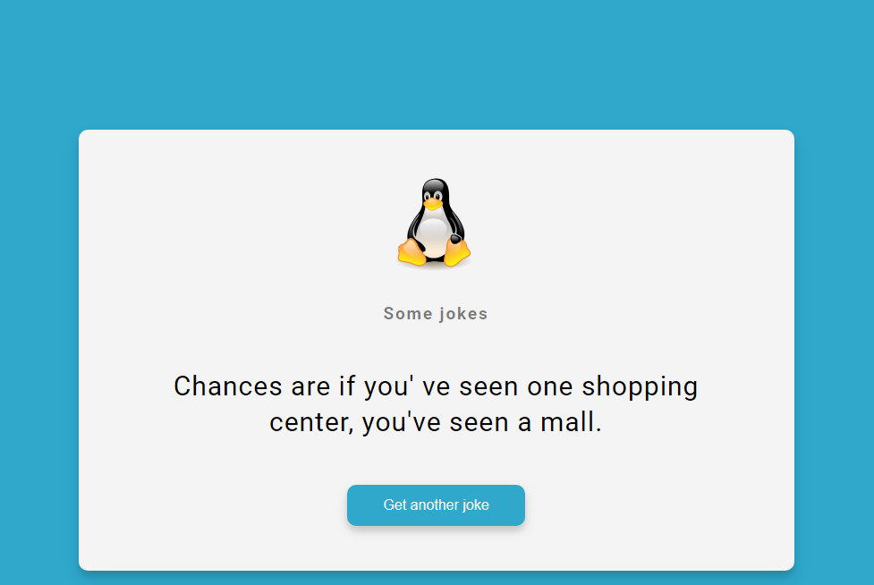
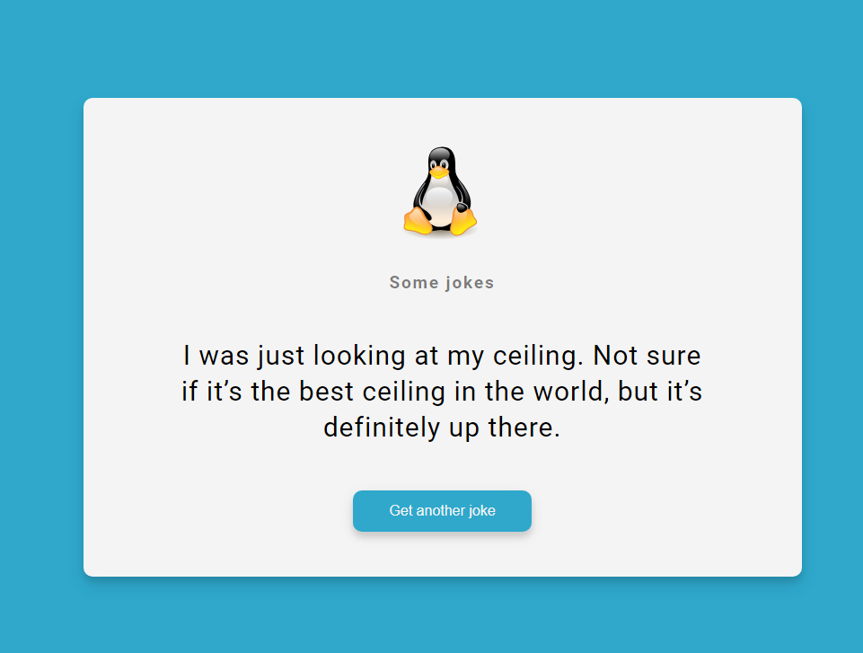

# js-env-from-scratch

Repozytorium ma za zadanie przedstawić tworzenie aplikacji Frontend bez wykorzystywania bibliotek zewnętrznych. Dodatkowo utworzono własne środowisko testów jednostkowych z wykorzystaniem Jasmine

Technologie:
- Javascript
- Webpack
- Babel
- Jasmine (Unit Tests)
- HTML
- SCSS

Przykładowe screeny:

